# **Git & GitHub**

## **Table of Contents**

- [Intro](#intro)
- [Git Workflow](#git-workflow)
    - [1. Working Directory](#1-working-directory)
    - [2. Staging Area/Git Index](#2-staging-areagit-index)
    - [3. Commit to Repository](#3-commit-to-repository-the-hidden-git-folder)
    - [4. Remote Repository](#4-remote-repository)
- [Configure Git](#configure-git)
- [Set Up Remote & Local Repositories](#set-up-remote--local-repositories)
    - [1. Make Repository](#1-make-your-repository-on-github-first)
    - [2. Clone it](#2-clone-it-using-https-clone-url-link-click-the-green-code-button-in-repository)
    - [3. Check it Works](#3-check-it-works)
    - [4. Add Files to Index](#4-add-files-to-index)
    - [5. Commit Changes](#5-commit-changes)
    - [6. Push changes to GitHub](#6-push-changes-to-github)
- [General Git Commands](#general-git-commands)
- [Logs/History](#logshistory)
- [Deleting/Unstaging changes](#deletingunstaging-changes)
- [Renaming & Moving Files](#renaming--moving-files)
- [Git Alias](#git-alias)
- [Untracking Files](#untracking-files)
- [Branching](#branching)
- [Merging](#merging)
- [Merge Conflicts!](#merge-conflicts)
- [Pushing & Pulling](#pushing--pulling)
- [README.md Files](#readmemd-files)
- [Credits](#credits)

 
 

## **Intro**

A source/version control system. Vast majority of developers & organisations use Git. Some use SVN (Apache Subversion) but it's not that great.
GitHub is the cloud version of Git. GitHub was originally an indepedent company, bought out by Microsoft in 2018.

Source control types:
**centralised & decentralised/distributed**

**Centralised** - needs internet connection to access the server with everything one

**Decentralised/distributed** - Mercurial (hg), Git. Most operations are local, so not internet dependent. Central server not required. 

Linus Torvalds created Git to help with developing Linux (good way to remember this - he is a git 😁)

 
 

## **Git Workflow**

### 1. **WORKING DIRECTORY**

The local storage that holds all your files for the repository. Git is aware of them whether they are used in Git or not. There’s a hidden folder called .git that contains the ACTUAL git repository. This is where the commits are.

 

### 2.	**STAGING AREA/GIT INDEX**

Holding area for queuing up changes for the next commit. Can move files in and out of here freely without affecting the Git repository.

 

### 3.	**COMMIT TO REPOSITORY** (the hidden .git folder)

Final changes saved.

 

### 4.	**REMOTE REPOSITORY**

GitHub. Basically your online cloud backup.

 
 

## **Configure Git**
 git config --global user.name “Millie Davidson” 
   git config --global user.email “millieaavidson@hotmail.com”

 

Check it’s stored this: Git config --global --list

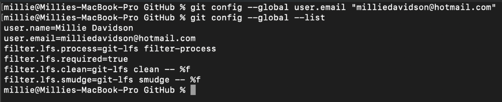

 
 

## **Set Up Remote & Local Repositories**

### 1.	Make Your Repository on GitHub First

 

### 2.	Clone It Using HTTPS Clone URL Link (Click The Green Code Button in Repository): 

  
 
Go to your computer’s terminal:
 
 cd to the directory you want to put the repository in 
  
 git clone www.github.com/put-repository-link-here.git

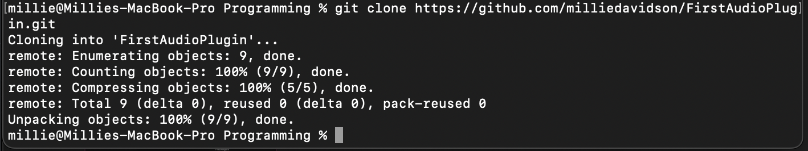  

Git copies your GitHub repository to your local system. Confirm it’s now there with  ls. You should see the README.md file in there:

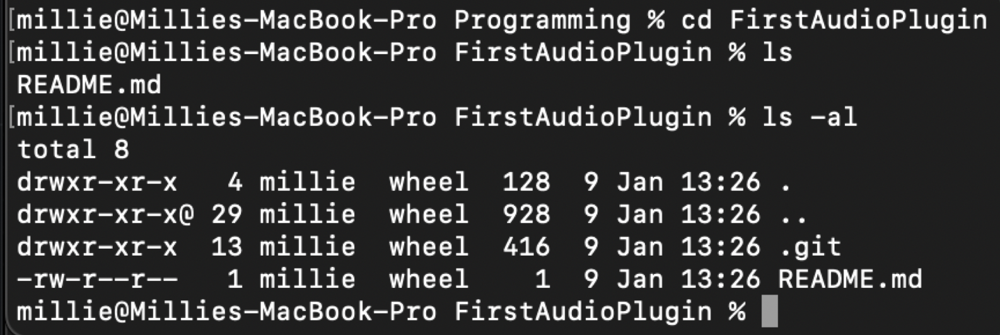

Always start in the repository folder you are working on. Good idea to start with a clean working tree by checking git status. Pull any changes BEFORE pushing.

In terminal: git status will tell you which branch you’re on.

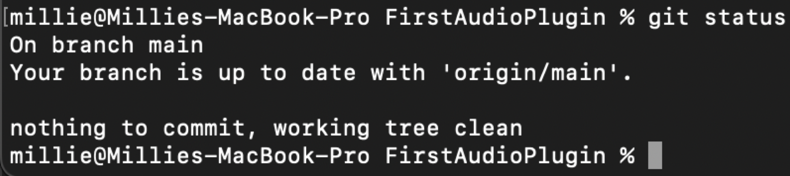

^^ this means it’s up to date with the GitHub branch

 

### 3.	Check it Works:

Make sure you’re in repository folder. 

echo “Name of Your Repository” >> test.txt

The >> outputs contents to where you specify. So this would put the text “Name of Your Repository” into the test.txt file. Check file has been made with ls. 

cat text.txt to view contents of file

Check git status

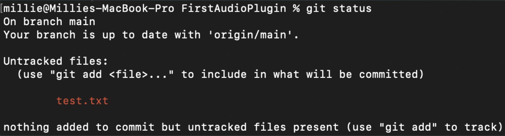
 
If untracked file, means not been added to Git yet. Need to tell Git about it!!

 
 

### 4. Add Files to Index

git add name-of-file-here.txt or git add . (called recursive add??) - adds all the untracked files. git add . or git add * - AVOID this when working on a project with others. Don't want to add everyone else's work too; it can get messy quickly.  

Can add to staging area AND commit in one go - git commit -am “commit message here”. Can only be done with **tracked files**. Modified files are added to index, then committed. 

Check git status

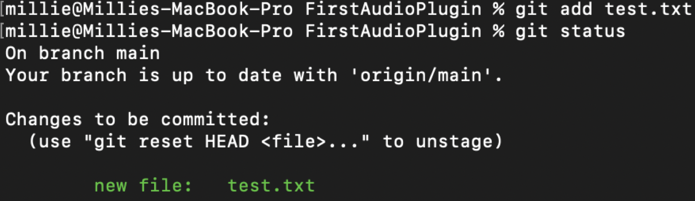

Tells us changes are in the staging area, ready to be committed. Staging area designed to build up a bunch of changes to be committed as one

 

### 5.	Commit Changes 

git commit -m “your commit message here”

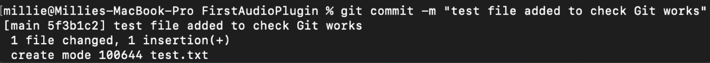

git status

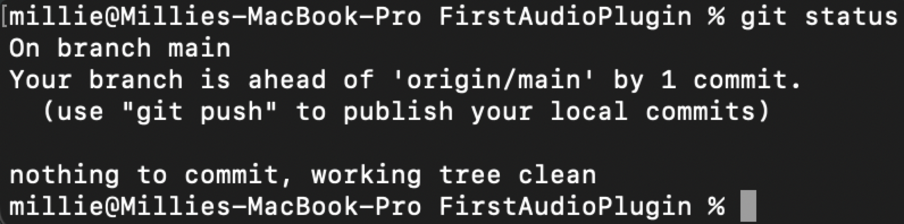

If everything up to date, will say “Working tree clean”. Now in the third stage. This git command is a LOCAL COMMAND, so it won’t be on GitHub yet. 

 
 

### 6.	Push Changes to GitHub

***Remember to pull before pushing!***

In terminal:
git push origin main
 
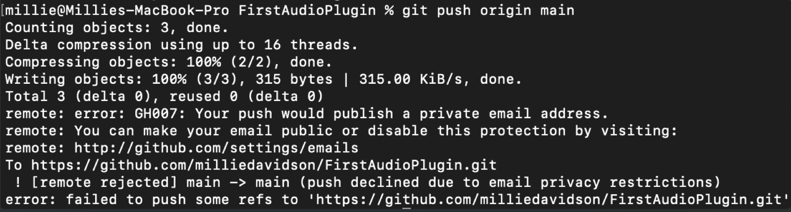

The origin refers to the remote copy (so in this case, GitHub). Main is the branch we want to push. You’ll be prompted for your username and password (I guess this is why people set up tokens?). Although I’m never prompted for some reason?

I got an error as my email was private:
"remote: error: GH007: Your push would publish a private email address.
remote: You can make your email public or disable this protection by visiting:
remote: http://github.com/settings/emails"

Went to the link and turned off this setting

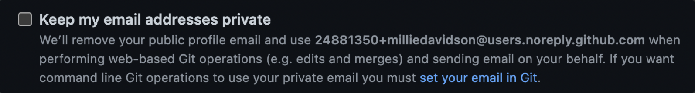
 
All good now

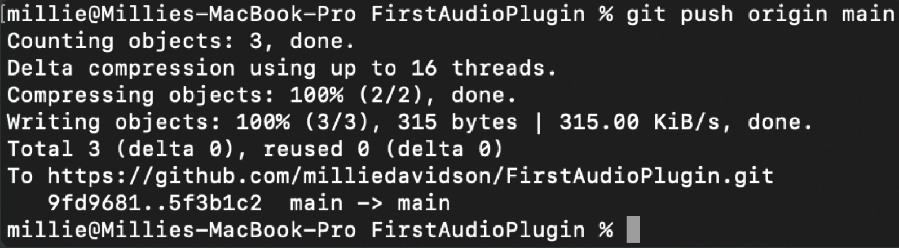
 
Verify changes have been successfully made to GitHub by refreshing and checking it there. 

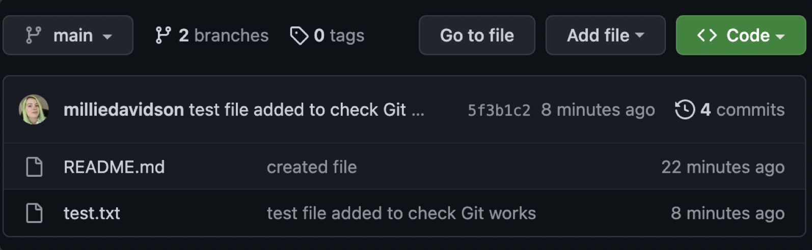

 
 

## **General Git Commands**

git init project-name-here or git init in the folder you want it in - makes an empty git repository locally 

ls -al - lists ALL files and folders incl, dot files & folders. You’ll see the .git folder where the git repository lives. 

Root-commit message - tells us this is first commit in the repository 

cd .. - goes back a directory 

~ tilde goes to home directory~

~ unzip /Downloads/name-of-file.zip - unzips a zip file

Git pull origin main - updates git repository with your changes on the remote repository

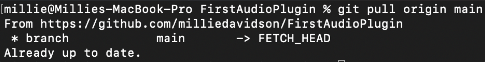

**ALWAYS pull before pushing!**

Tracked files - any file committed into the git repository, index or staging area. Git is aware of it and tracking

git ls-files - lists all files that git is tracking in the current repository 

mkdir - make a directory (folder)

For changes that span multiple files, add to staging area and then commit when finished is a good idea

 
 

## **Logs/History**

git help log - shows Git commit history. Top is the last commit you did, working backwards in time as you go down. Press q to exit.

When you commit, Terminal will show something like: master ba5b0f0. This number is the SHA-1 identifier for the commit. 

git log --abbrev-commit - will shorten the commit identifier. Usually only need the first 6/7 characters to uniquely identify a commit (though this grows as your commits do). 

git log --oneline --graph --decorate - oneline puts entries on one line. Graph brings up ASCII graph, showing branching graph. Decorate adds labels/tags/annotations.

git log ae6f872…761b911 - put the SHA identifiers in, shows you the specified range of commits.

git log --since=“3 days ago” - shows the commits that have happened in last 3 days.

git log -- file-name.txt - all the commits that involve this specific file. 

git log --follow -- path/to/file.txt - shows commit history for that specific file, going through the renames. 

git show b1986eB63817c7 - shows the specified commit with all the details INCL. diff information (what has changed).

 
 

## **Deleting/Unstaging Changes**

To **unstage** changes (put it back in your local working directory) - git reset HEAD file-name-here.txt

If you delete a file and then unstage that deletion, it won’t appear in your working directory (it's not an undo function :(). It’s only back in git staging area. Use the git checkout command -  git checkout -- file-name-here.txt

Discards changes in the working directory. i.e you’ve deleted your changes from EVERYWHERE and are back on the previous committed version. Check git status and you’ll be back to a clean working tree

Deleting files: if they aren’t tracked by git git rm file.txt won’t work. So delete normally with rm file.txt

rm -rf .git - removes the git folder, thereby removing all traces on git for the repository. r means recursive and f is force deletion. **Take CAUTION with this command!**

 
 

## **Renaming & Moving Files**

git mv file-name-here.txt - new-file-name-here.txt - it’s staged the file name change for you! Note, it hasn’t been *committed* though. Good idea to rename files **BEFORE** making changes.

git mv file-name.txt folder-name - this moves it to the specified folder (if it was same file type, it would write over it?)

If you rename in Bash (Terminal) or in Finder (normally) instead of through Git (e.g mv file.txt newfile.txt instead of git mv file.txt newfile.txt), Git sees this as TWO changes - file.txt has been deleted and newfile.txt is a new, untracked file. Sort this with git add -A. Git status will see you just renamed the file and update accordingly. 

There might be a ../.DS_store_ file that appears when renaming in Finder (just an OS file we don’t want to track). Just git add file-here.txt . Might want to update the index too - git add -u

 
 

## **Git Alias**

Instead of typing git log --all --graph --decorate --oneline to get a neat view, can create your own command for this called a **Git alias**. Check if the command already exists by typing it in (will say if doesn’t exist). 

git config --global alias.name-of-command-here “--all --commands --you-want-included --here” - global makes it available in EVERY repository i.e all of Git

To modify aliases, need to open git config file - mate ~/.gitconfig will open it up in TextMate to edit. A text editor is handy for multiple line commits too.

Alias will be under alias section; modify it there.

 
 

## **Untracking Files**

If don’t already have a .gitignore file (check with ls), make one with your text editor - mate .gitignore

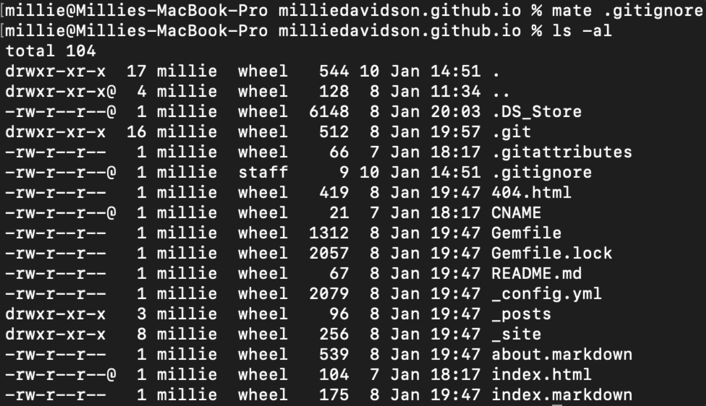
 
Patterns for .gitignore file:
-	Specific file e.g. **a-file.ext**
-	File pattern e.g. **.ext**
-	Folder e.g. **millie/my-folder**

Just write whatever file/folder/pattern it is (**one per line**) and done. NOTE .gitignore file needs adding to Git for version control (git add .gitignore and git commit -m “message here”). Pull then push!

 
 

## **Branching**

Timelines that contain your changes. Default branch is MAIN (still called Master sometimes).

Don’t do everything on main!! Make **feature/topic/develop/sprint branches** to isolate changes. Integrate them into main branch only once stabilised. Branches are just labels/pointers.

git branch -a - lists local and remote branches. There will be an asterisk by current active branch

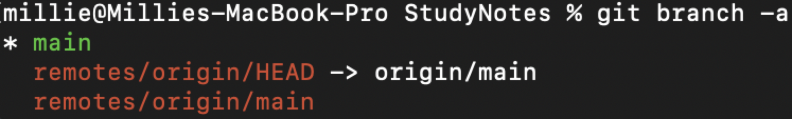
 
git branch new-branch-here - makes a new branch

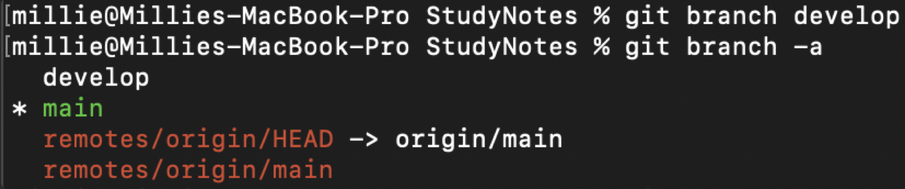
 
git checkout new-branch-here - switches branches to the specified one

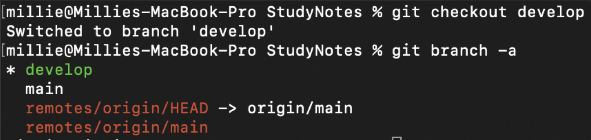

git branch -m my-new-branch new-branch - **-m** moves i.e overwrites and renames the file (here, that would rename to new-branch).

git branch -d new-branch - deletes branch locally. 
git push origin --delete new-branch - deletes branch remotely. Can’t delete a branch you’re already on, FYI!

git checkout -b new-branch-name - creates new branch AND checks out i.e. creates branch and switches you to it

git config --global init.defaultBranch develop - sets default branch to develop. I did this because I kept accidentally developing on the main branch every time I opened a new Terminal, which was really annoying!

 
 

## **Merging**

When merging changes: **REVIEW them first!**

git diff main develop - first reference branch + second reference branch. Shows you differences between those two branches. Hence the diff

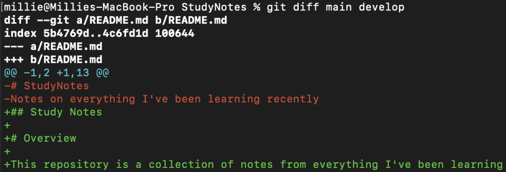

git difftool main develop - brings up visual merge differences, like you see on GitHub.

git merge develop - source branch I want merged into my ***current*** branch. Can delete that branch after merge. This is called fast-forwarding. 

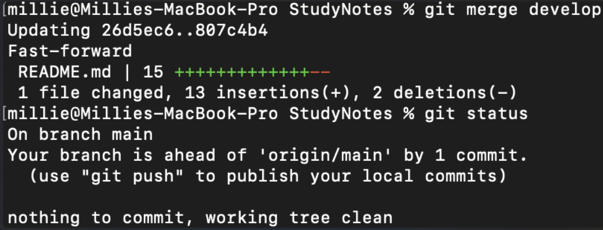

I did this one time and got a merge conflict:

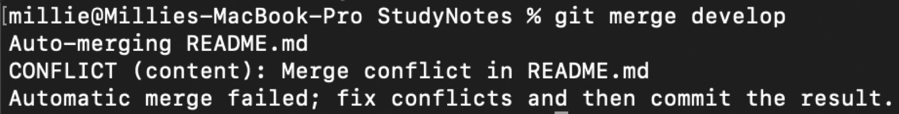

Clicked “resolve in merge editor” in my text editor:

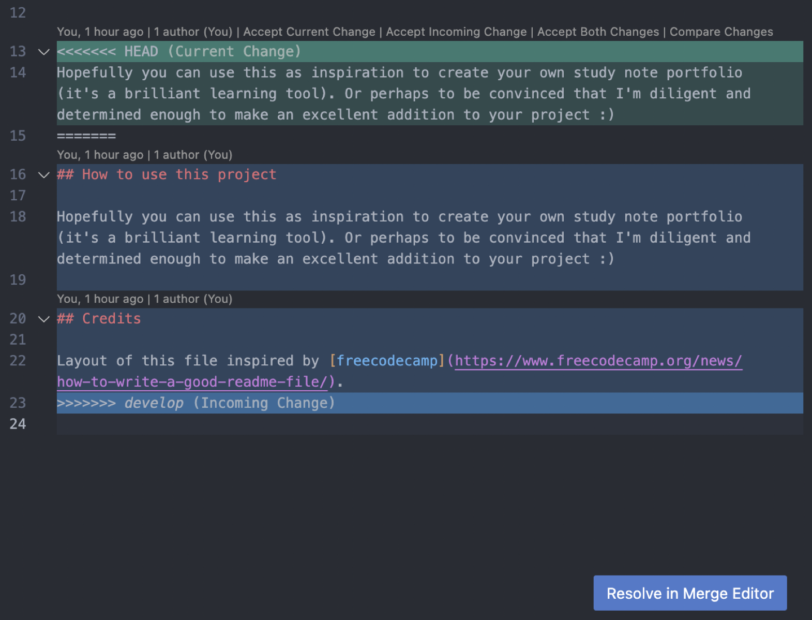
  
Found the conflict:

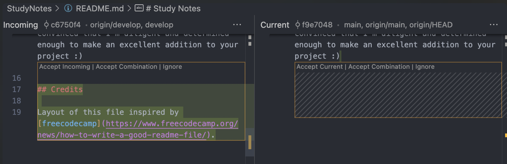
 
Clicked “accept incoming” on the part I wanted to commit. Clicked “complete merge”:

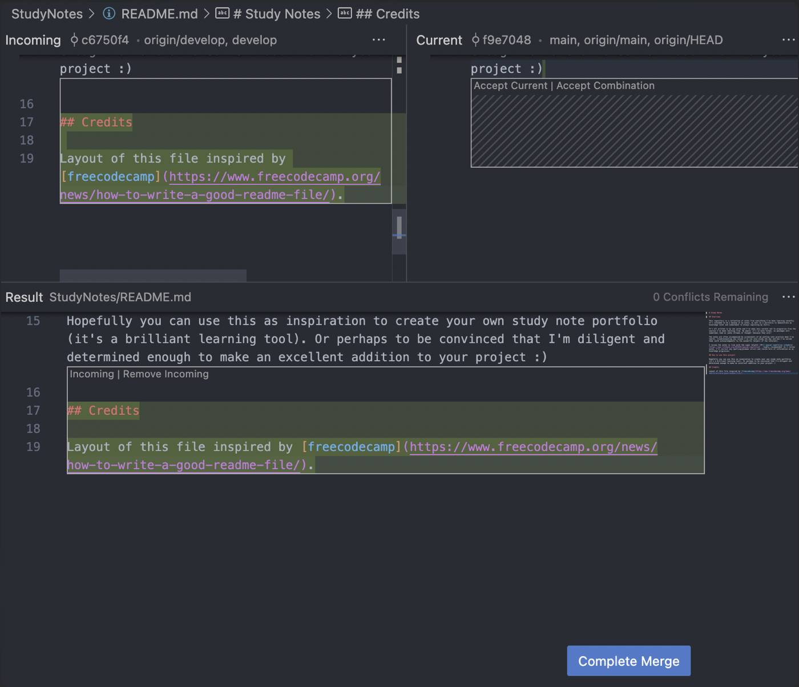
 
Checked git status - all good to try merging develop to main again:

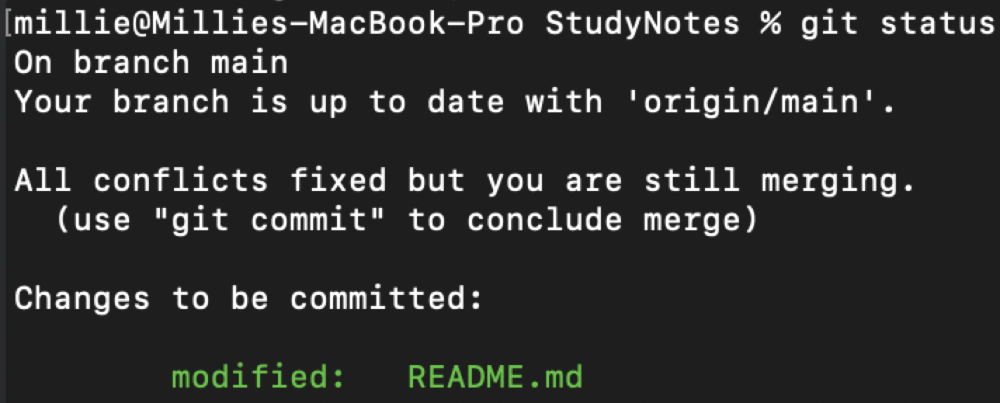

Got the error message again!

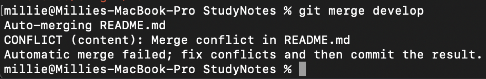

Think I forgot to commit the merge 😂. Committed it in Visual Studio Code source control. Then synced changes in same place. All fixed now.

git merge develop --no-ff - you get a merge commit. So the merge is backed up in case you want to undo it?

git merge develop -m “Commit message here” - automatic merge with automatic merge commit

If you do changes on one file on one branch and then more changes on same file in main branch, there will be conflicts. Can happen with multiple people working on the same repository. You'll be in a merging state, rather than clean, index etc.   

Once conflicts resolved, git status will say there's an untracked file - that's the original file that Git saved before you resolved the conflicts. It'll end in **.orig**. Probably don't want to track this, so add to .gitignore.

 
 

## **Merge Conflicts!**

COMMUNICATE WITH YOUR TEAM. Discuss and work out who is doing what, when etc. Everyone has their *own branch* to work on. Don't work on the same file as anyone else - if lots of work needed on a single file, pair up.

 
 

## **Pushing & Pulling**

I'd added a lot of screenshots to this file and when I went to push it to GitHub, it was taking forever. It seemed like it was just hanging.

I increased the **post buffer** size - git config --global http.postBuffer 524288000

Checked it configured correctly - git config --get http.postBuffer

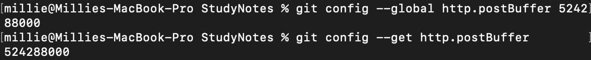

And it pushed in about 10 seconds! Success!

 
 

## **README.md Files**

Boring but super important! 

How can people use your project if they don't know how?

 
 

## **Credits** 

[GitHub - merge conflicts guide](https://docs.github.com/en/pull-requests/collaborating-with-pull-requests/addressing-merge-conflicts/resolving-a-merge-conflict-using-the-command-line)

[Stack Overflow - Git push taking ages](https://stackoverflow.com/questions/31895557/git-push-taking-ages)

[Sal Ferrarello - change default branch](https://salferrarello.com/git-change-default-branch-to-main/)

<!--add to credits - udemy course, kieran-->
<!--relink pics and add image descriptions-->
